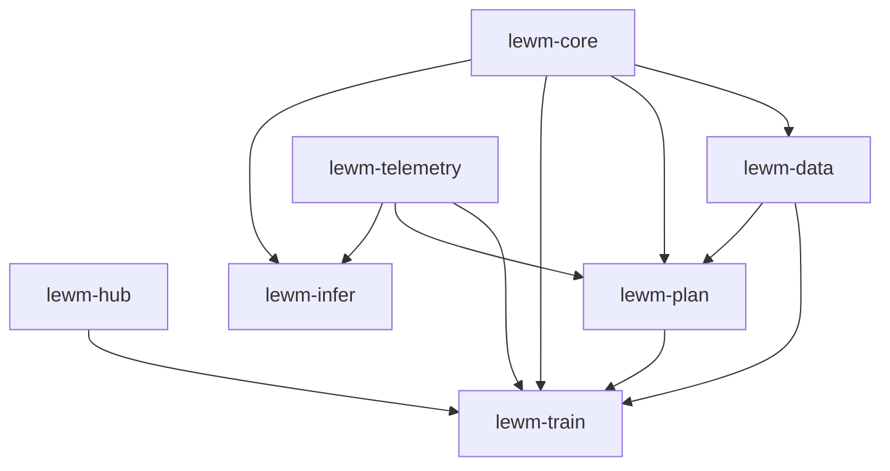
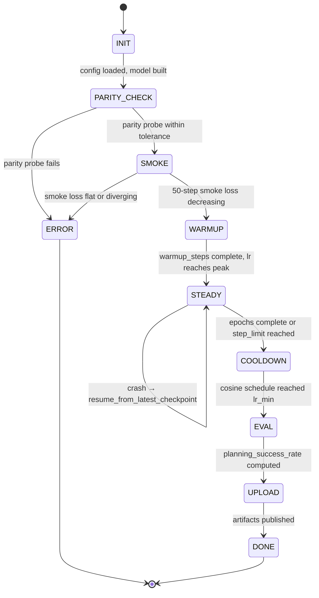

# `lewm-rs` — Master Technical Specification

> **Status:** Accepted · **Version:** 1.0.0 · **Date:** 2026-05-12 · **Custodian:** Abdel
>
> This document is the master technical specification for `lewm-rs`. It defines the cross-cutting architecture, contracts, requirements, and conformance criteria. Subsystem detail lives in the RFCs (`specs/rfcs/`); each subsystem clause here is paired with a forward link to its RFC.
>
> Together with the RFCs and the [PRD](../PRD.md), this document is the **complete and ultimate** source of truth for what `lewm-rs` is, how it behaves, and how we will know we have shipped it.

---

## Table of contents

- [0. Document conventions](#0-document-conventions)
- [1. System overview](#1-system-overview)
- [2. Functional requirements](#2-functional-requirements)
- [3. Non-functional requirements](#3-non-functional-requirements)
- [4. Architecture](#4-architecture)
- [5. Module specifications](#5-module-specifications)
- [6. Data contracts](#6-data-contracts)
- [7. Configuration system](#7-configuration-system)
- [8. Error model](#8-error-model)
- [9. Determinism and reproducibility contract](#9-determinism-and-reproducibility-contract)
- [10. Observability contract](#10-observability-contract)
- [11. Security and supply chain contract](#11-security-and-supply-chain-contract)
- [12. Conformance and acceptance](#12-conformance-and-acceptance)
- [13. Lifecycle and state machines](#13-lifecycle-and-state-machines)
- [14. Traceability summary](#14-traceability-summary)
- [15. Open questions and deferred decisions](#15-open-questions-and-deferred-decisions)
- [16. Appendices](#16-appendices)

---

## 0. Document conventions

This document inherits the conventions of [`specs/README.md` §2](README.md#2-conventions-used-throughout-this-spec-set). In particular:

- **MUST** / **SHOULD** / **MAY** are normative per RFC 2119/8174.
- Every requirement carries a stable identifier (`FR-NNN`, `NFR-NNN`, `INV-NNN`).
- Numerical tolerances are listed in [`glossary.md` §4](glossary.md#4-numerical-tolerances-default-constants).

Read [`glossary.md`](glossary.md) before this document.

---

## 1. System overview

### 1.1 Purpose

`lewm-rs` is a pure-Rust reproduction and extension of LeWorldModel (Maes et al., 2026; arXiv URL pending). It delivers, in priority order:

1. A reference Rust implementation of the LeWM architecture (encoder, predictor, action encoder, projector, SIGReg loss).
2. A training system that achieves ≥ 87 % planning success rate on PushT (paper reports 96 %).
3. An extension to the real-robot SO-100 pick-and-place dataset, with a published warm-start ablation.
4. A CPU inference pipeline (Tract) achieving sub-second cost computation on commodity laptops.
5. A complete artifact set on the Hugging Face Hub: code repo, two model repos, two dataset mirrors, one Space, one paper-style writeup.

### 1.2 Boundaries

The system **consists of** (and only of):

- The Rust workspace under `crates/`.
- A small Python adapter layer under `python/` (reference-weight conversion, MP4 decode, plotting, HF upload helpers) — Python is **only** at the edges per PRD §5.1.
- HF Jobs YAMLs under `jobs/` that launch cloud training.
- The artifacts published to HF Hub: `abdelstark/lewm-rs-pusht`, `abdelstark/lewm-rs-so100-pickplace`, `abdelstark/lewm-pusht-mirror`, `abdelstark/so100-pickplace-lewm-ready`, `abdelstark/lewm-rs-demo`.

The system **does not include**: a GPU inference path in Rust, distributed training, novel JEPA architectures, a graphical eval visualizer, or a hosted Inference Endpoint. See PRD §2 *Non-goals*.

### 1.3 Interfaces with the outside world

| Interface | Protocol / format | Direction | Authority |
|----------|-------------------|-----------|----------|
| HF Hub model repo | Git LFS over HTTPS | bidirectional | `huggingface_hub` Python lib; `hf-hub` Rust crate |
| HF Hub dataset repo | Git LFS over HTTPS | bidirectional | same |
| HF Jobs | REST + container image | outbound launch / inbound logs | `hf jobs` CLI |
| OTLP collector | gRPC | outbound | `opentelemetry-otlp` |
| Trackio Space | HTTPS | outbound | `trackio` Python (uploaded via Python adapter) |
| GitHub releases | git over HTTPS | outbound | `gh` CLI |
| CI runner (GitHub Actions) | GitHub-hosted runner | inbound | GitHub Actions workflow YAMLs |

All outbound credentials live in the secrets layer defined by [RFC 0016](rfcs/0016-security-and-supply-chain.md).

### 1.4 High-level data flow

```
                ┌────────────────────────────────────────────┐
                │              HF Hub (datasets)              │
                │  lewm-pusht ▸ pusht_expert_train.h5.zst     │
                │  svla_so100_pickplace ▸ parquet + MP4       │
                └─────────────────┬──────────────────────────┘
                                  │ download
                                  ▼
                ┌────────────────────────────────────────────┐
                │   python/decode_so100_to_h5.py (one-shot)   │  ◀── only for SO-100
                └─────────────────┬──────────────────────────┘
                                  │ HDF5 on local disk
                                  ▼
                ┌────────────────────────────────────────────┐
                │              lewm-data (Rust)               │
                │  streaming reader ▸ resize ▸ normalize ▸    │
                │  windowing ▸ collate                        │
                └─────────────────┬──────────────────────────┘
                                  │ (B, T, C, H, W), (B, T, A)
                                  ▼
                ┌────────────────────────────────────────────┐
                │              lewm-train (Rust)              │
                │     ViT → projector → MSE prediction        │
                │     SIGReg(projector(target))               │
                │     AdamW, BF16 mixed, grad-accum           │
                │     checkpoints + Trackio + OTLP            │
                └─────────────────┬──────────────────────────┘
                                  │ .mpk + .safetensors + .json
                                  ▼
                ┌────────────────────────────────────────────┐
                │              lewm-plan (Rust)               │
                │       CEM action search over rolled-out     │
                │       latent cost = MSE(pred, goal_emb)     │
                └─────────────────┬──────────────────────────┘
                                  │ planning success rate / Spearman
                                  ▼
                ┌────────────────────────────────────────────┐
                │     lewm-infer (Rust) — Tract CPU runner    │
                │       ONNX-export ▸ encoder ▸ predictor     │
                │       Gradio Space front-end                │
                └────────────────────────────────────────────┘
```

The above is the steady-state operational topology. The development-time pipeline additionally invokes the parity harness ([RFC 0008](rfcs/0008-reference-parity-testing.md)) on the reference PyTorch weights.

### 1.5 Conceptual model

LeWM is a single-loss JEPA from pixels. The encoder maps `(H, W, C)` images to a `D`-dimensional latent. The predictor advances the latent by one timestep given a 2- or 6-D action vector. Training optimizes:

$$
\mathcal{L} = \underbrace{\frac{1}{B(T-h)D}\sum_{b,t,d}\bigl(\hat{z}_{b,t,d} - z_{b,t,d}\bigr)^2}_{\mathcal{L}_{\text{pred}}} + \lambda \cdot \underbrace{\mathrm{SIGReg}\bigl(\mathrm{proj}(z)\bigr)}_{\mathcal{L}_{\text{sigreg}}}
$$

where `z` is the target embedding (encoder forward of the next frame), `ẑ` is the predictor's output, and `proj` is the `projector` MLP. The predictor consumes `history_size` prior embeddings and an action embedding; the encoder is **end-to-end trained** (no EMA, no stop-gradient).

A planning step searches an action sequence `a₁,…,aₜ` minimizing `MSE(rollout(z₀, a), z_goal)` via CEM.

---

## 2. Functional requirements

Functional requirements describe **what** `lewm-rs` does. Each `FR-NNN` is traceable to one or more PRD clauses and to one or more RFCs. The traceability matrix in §14 enumerates the full mapping; the table here gives a self-contained statement.

> **Notation.** "RFC X §Y" identifies the binding clause. "PRD §Z" identifies the originating motivation.

### 2.1 Model and loss

- **FR-001 — ViT encoder.** The system **MUST** implement the HF `transformers` ViT-Small architecture with `patch_size=16`, `image_size=224`, `hidden=384`, `depth=12`, `heads=6`, no mask token. Forward path takes `(B, C, 224, 224)` and returns `last_hidden_state` of shape `(B, 197, 384)`. — RFC 0002 §4; PRD §5.2.

- **FR-002 — CLS extraction.** The system **MUST** expose `cls(hidden) -> Tensor<B, 2>` returning the CLS row of `last_hidden_state` (i.e., index 0 on the second axis). — RFC 0002 §4.3.

- **FR-003 — Action encoder.** The system **MUST** implement `Embedder` with shape-preserving `Conv1d(kernel=1)` followed by `Linear → SiLU → Linear`. Input `(B, T, A)`, output `(B, T, E_a=64)`. — RFC 0002 §4.5; PRD §4.1.

- **FR-004 — ARPredictor.** The system **MUST** implement an autoregressive predictor with `depth=6`, `heads=6`, `dim_head=64`, `mlp_dim=1536`, causal SDPA, AdaLN-zero conditioning on action embeddings, learned positional embedding, and zero-initialized final adaLN linear. — RFC 0002 §4.6; PRD §4.1.

- **FR-005 — Projector and pred_proj MLPs.** The system **MUST** implement two two-layer MLPs (`input=384`, `hidden=1536`, `output=384`) using BatchNorm1d and GELU. — RFC 0002 §4.7; PRD §5.2.

- **FR-006 — JEPA wrapper.** The system **MUST** expose `encode`, `predict`, `rollout`, `criterion`, and `get_cost` on the top-level `Jepa` module, with semantics matching `jepa.py::JEPA`. — RFC 0002 §4.8.

- **FR-007 — Prediction loss.** The system **MUST** compute `L_pred = mean((pred_proj(predicted) - projector(target))²)` over the batch, time, and feature axes. — RFC 0003 §4.1.

- **FR-008 — SIGReg.** The system **MUST** implement the Epps–Pulley SIGReg with `K=1024` projections and `J=17` frequency knots on `[0, 3]`, with **all** internal arithmetic in F32 regardless of the outer precision. — RFC 0003 §4.2; PRD §4.1.

- **FR-009 — Total loss.** The system **MUST** combine the two losses as `L = L_pred + λ · L_sigreg` with `λ` configurable (default `1.0`). — RFC 0003 §4.3.

- **FR-010 — Rollout.** The system **MUST** implement autoregressive rollout with default `history_size=3`, producing the next `T − h` embeddings given the first `h` and the action sequence. — RFC 0002 §4.8; PRD §4.1.

- **FR-011 — Cost function.** The system **MUST** expose `get_cost(z, a, z_goal) = MSE(rollout(z, a)[:, -1], z_goal)`. — RFC 0002 §4.8.

### 2.2 Reference parity

- **FR-020 — Reference weight import.** The system **MUST** load reference weights from `quentinll/lewm-pusht` (PyTorch `.pt`) via the Safetensors intermediate produced by `python/convert_reference.py`. — RFC 0008 §4.

- **FR-021 — Parity tolerance, encoder.** With reference weights loaded and on a fixed `(B=4, T=4, C=3, 224, 224)` deterministic input (RFC 0008 §5), the encoder CLS output **MUST** match the PyTorch reference dump within `ε_CLS_abs = 1e-4` (L∞ norm). — RFC 0008 §6.

- **FR-022 — Parity tolerance, predictor.** Same input, predictor output **MUST** match within `ε_pred_abs = 1e-4` (L∞ norm). — RFC 0008 §6.

- **FR-023 — Parity tolerance, SIGReg.** With identical seed for the random sketch, SIGReg scalar **MUST** match within `ε_sigreg_abs = 1e-3`. With a different seed, **MUST** match within `ε_sigreg_seedfree_rel = 5e-2` (relative). — RFC 0008 §6.

### 2.3 Data

- **FR-030 — PushT loader.** The system **MUST** stream PushT samples from the HDF5 archive produced by the upstream pipeline. — RFC 0004 §4.

- **FR-031 — SO-100 loader.** The system **MUST** load SO-100 samples from the LeRobot v2.1 layout (Parquet for actions, MP4 per-episode for video). For v1 the MP4 decode **MAY** be a Python pre-pass producing an HDF5 mirror (allowed under PRD §5.1). — RFC 0004 §5; PRD §4.4 risk 5.

- **FR-032 — Image preprocessing.** Images **MUST** be resized to `224×224` with bilinear interpolation and normalized with the ImageNet statistics that the reference ViT was trained on (mean `[0.5, 0.5, 0.5]`, std `[0.5, 0.5, 0.5]` per HF ViT config). — RFC 0004 §6.2.

- **FR-033 — Action normalization.** Action vectors **MUST** be normalized per dimension to zero mean and unit variance using statistics computed from the training split and stored in the config. — RFC 0004 §6.3.

- **FR-034 — Window sampling.** The loader **MUST** emit windows of length `T = horizon` (default `8`) with `history_size = 3` warm-up frames, sampled uniformly within an episode such that the window does not cross episode boundaries. — RFC 0004 §6.4.

### 2.4 Training

- **FR-040 — Train binary.** The system **MUST** provide `lewm-train` with subcommands `train`, `smoke`, `parity`, `eval`, `convert`. — RFC 0005 §4.

- **FR-041 — Optimizer.** The system **MUST** support AdamW with `β₁=0.9, β₂=0.95, weight_decay=0.05`, cosine schedule with `warmup_steps=1000` and `lr_peak=3e-4, lr_min=1e-5`. — RFC 0005 §5.

- **FR-042 — Grad accumulation.** The system **MUST** implement gradient accumulation. Default `batch=64, grad_accum=2` → effective batch `128`. — RFC 0005 §5.4.

- **FR-043 — Gradient clipping.** The system **MUST** clip the global gradient L2 norm to `1.0`. Pre-clip norm **MUST** be emitted as a metric (TOL-011 abort threshold). — RFC 0005 §5.5.

- **FR-044 — Mixed precision.** The system **MUST** support a `bf16_mixed` training mode where forward/backward run in BF16 but the optimizer and the SIGReg path run in F32. — RFC 0005 §5.6; PRD §4.4 risk 2.

- **FR-045 — Checkpoints.** The system **MUST** write a Burn record (`.mpk`), a Safetensors mirror, and a JSON sidecar at every epoch boundary. — RFC 0005 §6.1; PRD §6.3.

- **FR-046 — Resume.** The trainer **MUST** support resume-from-checkpoint preserving RNG state, optimizer state, scheduler state, and step counter. — RFC 0005 §6.2.

- **FR-047 — Parity probe per epoch.** The trainer **MUST** run a parity probe on a fixed input each epoch and write `step_{N}.parity.json`. — RFC 0005 §6.3; PRD §6.3.

### 2.5 Planning and evaluation

- **FR-050 — CEM planner.** The system **MUST** implement Cross Entropy Method with configurable iterations, candidates, and elites. Default for PushT: 5 iterations, 1000 candidates, 100 elites, horizon 5. — RFC 0006 §4; PRD §9.1.

- **FR-051 — Planning success rate.** The PushT evaluator **MUST** report planning success rate over 50 episodes from the held-out split. — RFC 0006 §5; PRD §9.1.

- **FR-052 — Latent rollout metrics.** The SO-100 evaluator **MUST** report (a) latent MSE between predicted and target rollouts and (b) Spearman rank correlation of pairwise distances. — RFC 0006 §6; PRD §9.2.

- **FR-053 — Warm-start delta.** The SO-100 evaluator **MUST** report the warm-start delta = latent-MSE(from-scratch) − latent-MSE(PushT-warm-started). — RFC 0006 §6.3.

### 2.6 Inference

- **FR-060 — ONNX export.** The system **MUST** export trained models to ONNX opset ≥ 18 via Burn's ONNX path. Failure to export any op **MUST** trigger the NNEF fallback (defined in RFC 0007 §5). — RFC 0007 §4.

- **FR-061 — Tract runner.** `lewm-infer plan` **MUST** load a Tract model from an ONNX or NNEF file, accept start and goal images, run the encoder, perform a CEM-style cost computation over 16 action candidates and 5 timesteps, and emit the best action sequence and the cost. — RFC 0007 §6.

- **FR-062 — Inference latency target.** On a representative laptop CPU (16 GB RAM, Apple M-series or Intel i7 ultrabook), the steady-state planning cost computation **MUST** complete in **≤ 1.0 second** wall-clock. On HF Jobs CPU XL, **≤ 0.3 seconds**. — RFC 0007 §8; PRD §9.3.

### 2.7 Artifacts and reporting

- **FR-070 — Trackio runs.** Every training run **MUST** be tracked in Trackio with the metrics enumerated in PRD §6.1. — RFC 0009 §4.

- **FR-071 — Tensorboard mirror.** Every training run **MUST** simultaneously write a Tensorboard `events.out.tfevents.*` file as a portability backstop. — RFC 0009 §4.2.

- **FR-072 — OTLP traces.** Every training run **MUST** emit OTLP traces with the span names enumerated in PRD §6.1. — RFC 0009 §5.

- **FR-073 — Model card.** Each published model **MUST** include a card following the template in PRD §17, with all metrics filled in. — RFC 0010 §4.

- **FR-074 — Cost ledger.** The repo **MUST** include `reports/cost.md` updated on every HF Jobs run. — RFC 0010 §6; PRD §7.

### 2.8 ml-intern guard rails

- **FR-080 — Tier restrictions.** The `.ml-intern/cli_agent_config.json` **MUST** encode the allowed/forbidden list of PRD §6.6. — RFC 0016 §6.

- **FR-081 — Session audit.** Every ml-intern session **MUST** be uploaded to a private HF dataset for audit. — RFC 0016 §6.

---

## 3. Non-functional requirements

### 3.1 Correctness

- **NFR-001 — Parity-tested correctness.** The implementation's numerical outputs **MUST** match the PyTorch reference within the tolerances of TOL-001/002/003. Violation is a release-blocking bug.

- **NFR-002 — Determinism contract.** Given the same seed, input, and backend, two runs **MUST** produce bitwise-identical loss curves through step 100 (on a fixed CPU backend) and statistically-identical curves on GPU per §9.

- **NFR-003 — Static type safety.** The Rust code **MUST** compile under `-D warnings` with the lint set defined in [RFC 0011 §6](rfcs/0011-ci-cd-and-release-engineering.md). No `unwrap()` outside of test code; production code uses `Result` or `expect("invariant: …")` with an explicit invariant statement.

### 3.2 Performance

- **NFR-010 — PushT throughput target.** On a single A10G-large with effective batch `128` and BF16-mixed, the trainer **MUST** sustain ≥ **45 samples/sec** end-to-end (data pipeline included) averaged over a 1000-step window. Justification: at 920k frames × 10 epochs / 45 samples/sec ≈ 56 hours, well within the budget of two T3 runs.

- **NFR-011 — SO-100 throughput target.** Same hardware, **≥ 35 samples/sec** with the SO-100 6-D action stack.

- **NFR-012 — GPU memory ceiling.** Peak GPU memory **MUST** be ≤ **20 GB** on the A10G-large 24 GB, leaving 4 GB headroom.

- **NFR-013 — Inference latency, laptop.** Cf. FR-062.

- **NFR-014 — Cold-start time.** `lewm-infer plan` **MUST** complete the first inference (load + first forward) in ≤ **3 seconds** on a laptop CPU.

### 3.3 Reliability

- **NFR-020 — Crash-resume.** A trainer killed mid-step **MUST** resume from the latest checkpoint and produce identical step-counter and RNG state.

- **NFR-021 — Idempotent uploads.** Hub uploads **MUST** be idempotent: replaying a failed upload **MUST NOT** produce duplicate commits or corrupted LFS pointers.

- **NFR-022 — Resource leaks.** No file handle, GPU allocation, or socket may leak across a successful job termination. Asserted in CI by `valgrind`-equivalent checks on the CPU smoke job.

### 3.4 Usability and DX

- **NFR-030 — One-command quickstart.** A first-time user **MUST** be able to clone, run `cargo test`, and see green tests with no further setup beyond Rust toolchain + the `nightly` features pinned in `rust-toolchain.toml`.

- **NFR-031 — Error messages.** Every user-visible error **MUST** carry a 3-part shape: *what failed*, *the smallest reproducer*, *the fix or next step*. Enforced by the error-message style guide in [RFC 0017 §7](rfcs/0017-error-model-and-failure-handling.md).

- **NFR-032 — Docs build.** `cargo doc --workspace` **MUST** complete without warnings, and the `nightly` feature `--document-private-items` **MUST** be supported by the docs job.

### 3.5 Compliance and licensing

- **NFR-040 — Licensing audit.** Every dependency in `Cargo.lock` **MUST** carry an OSI-approved license compatible with MIT (the project's outbound license). Enforced via `cargo deny` in CI per [RFC 0016 §5](rfcs/0016-security-and-supply-chain.md).

- **NFR-041 — Attribution.** Every published artifact **MUST** carry the upstream LeWM citation block.

### 3.6 Reproducibility

- **NFR-050 — Reproducible build.** A `cargo build --release` from a clean checkout at a fixed commit on Linux x86_64 with the pinned toolchain **MUST** produce bit-identical binaries (modulo timestamps). Enforced in [RFC 0011 §8](rfcs/0011-ci-cd-and-release-engineering.md).

- **NFR-051 — Reproducible training.** Given the same dataset commit, same seed, same backend, same hardware, two training runs **MUST** produce the same metrics to **TOL-005**. See §9.

### 3.7 Cost

- **NFR-060 — Cost ceiling.** Total project HF Jobs spend **MUST NOT** exceed 200 USD. Hard alert at 100 USD. Per-job spend gated by per-job `--timeout`. — RFC 0010 §7; PRD §7.

---

## 4. Architecture

### 4.1 Layered view

```
┌──────────────────────────────────────────────────────────────────────┐
│  Layer 5 — Artifacts & docs                                          │
│   reports/, paper/, model cards, Space, blog post                    │
├──────────────────────────────────────────────────────────────────────┤
│  Layer 4 — Orchestration                                             │
│   jobs/*.yaml, scripts/*, ml-intern, CI workflows                    │
├──────────────────────────────────────────────────────────────────────┤
│  Layer 3 — Binaries                                                  │
│   lewm-train · lewm-eval · lewm-infer                                │
├──────────────────────────────────────────────────────────────────────┤
│  Layer 2 — Application crates                                        │
│   lewm-train · lewm-plan · lewm-infer (lib parts)                    │
├──────────────────────────────────────────────────────────────────────┤
│  Layer 1 — Domain crates                                             │
│   lewm-core (model, losses)        ← pure compute, no I/O            │
│   lewm-data (loaders, transforms)  ← I/O, no model                   │
│   lewm-hub   (HF upload helpers)                                     │
│   lewm-telemetry (metrics + traces)                                  │
├──────────────────────────────────────────────────────────────────────┤
│  Layer 0 — Foundations                                               │
│   burn (GPU/CPU tensor) · tract (CPU inference) · serde · tracing    │
└──────────────────────────────────────────────────────────────────────┘
```

A crate at layer `N` **MAY** depend on any layer-`M` crate where `M < N`. **MUST NOT** depend on a same-layer or higher-layer crate. This is enforced by [`scripts/check_layers.py`](rfcs/0011-ci-cd-and-release-engineering.md) in CI.

### 4.2 Crate dependency graph (Rust workspace)



**Invariants of the graph:**

- **INV-001** — `lewm-core` **MUST NOT** depend on any other workspace crate. It is the immovable centre.
- **INV-002** — `lewm-data` **MUST NOT** depend on `lewm-train`, `lewm-plan`, or `lewm-infer`. It owns I/O, not orchestration.
- **INV-003** — `lewm-infer` **MUST NOT** depend on `burn-cuda` or `burn-autodiff`. Inference is CPU-only.
- **INV-004** — No crate **MAY** depend on Python (via PyO3) without a published ADR. v1 has no PyO3.

### 4.3 Process and runtime view

`lewm-rs` runs as **either** a long-lived training process **or** a short-lived inference process. There is no continuously running service. The cloud orchestration is HF Jobs, which spawns a containerized job per launch.

A training process:

- One main thread driving the optimization loop.
- One Tokio runtime (multi-thread) for I/O: HDF5/Parquet reads, checkpoint writes, OTLP exporter, HF uploads.
- One Burn device backend (CUDA stream-pooled) for compute. Tensor ops are synchronous from Rust's perspective; Burn manages device asynchronicity internally.
- N data-loader workers (default `N = 4`): blocking-threadpool workers reading from disk via `tokio::task::spawn_blocking`.

An inference process:

- One main thread, no async runtime.
- Tract synchronous CPU execution.

### 4.4 Storage architecture

| Logical store | Physical | Lifetime | Access |
|---------------|----------|---------|--------|
| Source code | Git (GitHub) | permanent | clone/push |
| Test fixtures | Git LFS (≤ 50 MB total) | permanent | clone-with-lfs |
| Large datasets | HF Hub dataset repos | permanent | `hf download` |
| Checkpoints | HF Hub model repos | permanent | `hf upload` |
| Run artifacts (logs, parity probes) | Job-local disk, then HF artifacts repo | per run | upload at run end |
| Trackio runs | Trackio Space | permanent | HTTPS |
| OTLP traces | Self-hosted Tempo via `infra/otel` | operator-defined retention | gRPC export |

No data sits exclusively on a developer laptop. The HF Hub is the single durable store of record.

### 4.5 Build and packaging

- **Compilation unit:** Rust workspace with `resolver=2`, edition 2024.
- **Toolchain:** pinned in `rust-toolchain.toml` (see [RFC 0001 §3.1](rfcs/0001-project-foundation-and-build-system.md)).
- **Profiles:** `dev`, `release`, `release-lto`, `bench`. Listed in [RFC 0001 §6](rfcs/0001-project-foundation-and-build-system.md).
- **Container image:** `ghcr.io/abdelstark/lewm-rs:<sha>` and `:latest`. Multi-stage Dockerfile in [RFC 0011 §5](rfcs/0011-ci-cd-and-release-engineering.md).
- **Distributable binaries:** static-linked `lewm-train`, `lewm-eval`, `lewm-infer` published as GitHub Release assets per [RFC 0011 §7](rfcs/0011-ci-cd-and-release-engineering.md).

---

## 5. Module specifications

Each subsection here is a **contract summary**. The binding detail is in the linked RFC.

### 5.1 `lewm-core` — model and losses

- Owns the model definitions: `Vit`, `ArPredictor`, `Embedder`, `Mlp`, `Jepa`.
- Owns the loss math: `sigreg`, `prediction_loss`.
- **MUST NOT** read or write files, network, or env-vars. Pure compute.
- See [RFC 0002](rfcs/0002-core-model-architecture.md) and [RFC 0003](rfcs/0003-sigreg-and-loss-functions.md).

### 5.2 `lewm-data` — datasets and transforms

- Owns the loaders for PushT (HDF5) and SO-100 (Parquet + MP4 or HDF5 mirror).
- Owns transforms: resize, normalize, window sampling, action normalization, collate.
- **MUST** be free of model-specific code beyond shape contracts.
- See [RFC 0004](rfcs/0004-data-pipeline.md).

### 5.3 `lewm-train` — training application

- Owns the trainer loop, optimizer, scheduler, grad accum, checkpointing, eval triggers.
- Owns the `lewm-train` binary.
- See [RFC 0005](rfcs/0005-training-system.md).

### 5.4 `lewm-plan` — planning and evaluation

- Owns CEM, the PushT evaluator, the SO-100 evaluator.
- Owns the `lewm-eval` binary.
- See [RFC 0006](rfcs/0006-planning-and-evaluation.md).

### 5.5 `lewm-infer` — Tract inference

- Owns the ONNX/NNEF runner and the planning cost computation on CPU.
- Owns the `lewm-infer` binary.
- See [RFC 0007](rfcs/0007-tract-inference-and-onnx-export.md).

### 5.6 `lewm-telemetry` — observability

- Wraps `tracing`, `tracing-opentelemetry`, and a Tensorboard writer.
- Exposes a single facade for emitting metrics, log lines, and spans from anywhere in the workspace.
- See [RFC 0009](rfcs/0009-observability-and-mlops.md).

### 5.7 `lewm-hub` — HF Hub helpers

- Wraps `hf-hub` for downloads and a Python adapter (via `pyo3` only in test/dev mode) for uploads where the Rust client lags.
- Owns model-card generation, dataset-mirror manifest production, cost-ledger append.
- See [RFC 0010](rfcs/0010-huggingface-hub-integration.md).

---

## 6. Data contracts

### 6.1 Tensor shape contract

Throughout `lewm-rs`, tensor shapes follow these conventions verbatim:

| Symbol | Meaning | Concrete |
|--------|---------|----------|
| pixels | `(B, T, C, H, W)` | `(B, 8, 3, 224, 224)` |
| pixels_flat | `(B·T, C, H, W)` | `(B·8, 3, 224, 224)` |
| hidden | `(B·T, P+1, D)` | `(B·8, 197, 384)` |
| cls | `(B·T, D)` | `(B·8, 384)` |
| cls_seq | `(B, T, D)` | `(B, 8, 384)` |
| action | `(B, T, A)` | `(B, 8, 2)` PushT, `(B, 8, 6)` SO-100 |
| action_emb | `(B, T, E_a)` | `(B, 8, 64)` |
| pred | `(B, T−h, D)` | `(B, 5, 384)` with `h=3, T=8` |
| target | `(B, T−h, D)` | same |

Every public function signature in `lewm-core` **MUST** state both rank and meaning in its rustdoc. Internal helpers **SHOULD** likewise.

### 6.2 Configuration on-disk format

- Format: **TOML 1.0**.
- Schema: defined in [RFC 0018 §4](rfcs/0018-configuration-system.md).
- Loading: `lewm-train --config <path>` with optional `--set key=value` overrides; merge order is `defaults < file < CLI`.

A full PushT config is reproduced verbatim in PRD §5.2 and is the test fixture for the config loader.

### 6.3 Checkpoint format

- Burn record: MessagePack-encoded by `burn::record::NamedMpkFileRecorder`. Filename pattern `step_{N}.mpk`.
- Safetensors mirror: produced by `lewm-core::export::to_safetensors`. Filename pattern `step_{N}.safetensors`.
- Sidecar metadata: JSON object `{config_hash, rng_state, git_sha, wall_time_s, step, epoch, parity}`. Filename `step_{N}.json`.

Schema for each is locked in [RFC 0005 §6.1](rfcs/0005-training-system.md).

### 6.4 Run identifiers

- `run_id = "{YYYYMMDD-HHMMSS}-{git_short_sha}-{slot}"` where `slot` is a 4-character alphanumeric token assigned by the launcher to disambiguate concurrent runs.
- `step_id = "{run_id}/step_{N:07d}"` — globally unique across the project's history.

---

## 7. Configuration system

See [RFC 0018](rfcs/0018-configuration-system.md) for the binding contract. Highlights:

- All configurable knobs live in **one** Rust struct hierarchy with `serde::Deserialize`.
- Defaults are encoded **in the Rust struct** as `#[serde(default = "...")]` and are the source of truth — TOML files override but do **not** define new keys.
- Validation runs at load time via `validator` crate constraints (range, regex, custom).
- Unknown keys are an **error** (`#[serde(deny_unknown_fields)]`), not a warning.

This rules out the classic ML failure mode where a typoed key is silently ignored.

---

## 8. Error model

The full taxonomy is in [RFC 0017](rfcs/0017-error-model-and-failure-handling.md). Summary:

- Libraries (`lewm-core`, `lewm-data`, `lewm-hub`, `lewm-telemetry`) **MUST** define their own `thiserror`-based error types and re-export them.
- Binaries (`lewm-train`, `lewm-eval`, `lewm-infer`) use `anyhow` at the outermost boundary and `?` to propagate.
- **MUST NOT** use `unwrap` or `expect` without an explicit invariant string in production code.
- All errors implement `std::error::Error` and `Display`. `Display` is the user-facing message; `Debug` is the developer message.
- Panics are reserved for *bugs*, never *user input*. Panicking on a malformed config is a defect.

---

## 9. Determinism and reproducibility contract

See [RFC 0013](rfcs/0013-determinism-and-reproducibility.md) for the full spec. Highlights:

### 9.1 RNG architecture

A single global RNG seed (default `0`) seeds a tree of named sub-streams:

```
seed=0
 ├── rng:data_shuffle  (per-epoch deterministic shuffle)
 ├── rng:model_init    (parameter init)
 ├── rng:sigreg_sketch (projection matrix sampling)
 ├── rng:dropout       (per-step dropout mask)
 └── rng:cem           (CEM action sampling)
```

Each sub-stream uses ChaCha20 from `rand_chacha`. Sub-stream seeds are derived deterministically via BLAKE3-of-`(seed, name)`.

### 9.2 Determinism levels

| Level | Backend | Guarantee | Use case |
|-------|---------|-----------|----------|
| `Strict` | `NdArray<f32>` CPU | Bitwise identical across runs and machines | Unit tests, parity, smoke L2 |
| `Strong` | single-GPU Burn-CUDA F32 | Bitwise identical across runs on same hardware/driver | T1, T2 |
| `Statistical` | single-GPU Burn-CUDA BF16 mixed | Identical to TOL-010 | T3 |
| `Best-effort` | A100 vs A10G | Same metrics to TOL-005 | Cross-hardware comparison |

CI **MUST** enforce Strict at L0/L1/L2 (CPU). T3 runs **MUST** record the determinism level used in their report.

### 9.3 Non-determinism sources we cannot eliminate

- `cublas` reduction-order non-determinism in low-level GEMM (mitigated by `CUBLAS_WORKSPACE_CONFIG=:4096:8` and `:16:8`).
- BF16 round-off in mixed precision (bounded by TOL-010).
- File-system enumeration order in directory scans (eliminated: we sort).

---

## 10. Observability contract

See [RFC 0009](rfcs/0009-observability-and-mlops.md) for the full spec. Highlights:

- **Metrics** flow to Trackio (primary) and Tensorboard (mirror).
- **Traces** flow to the optional self-hosted OTLP stack.
- **Logs** are structured JSON to stdout, captured by HF Jobs.
- Every metric carries a stable name in the dot-separated form `{namespace}/{metric}` (e.g., `loss/total`, `optim/lr`).
- Every span carries a `run_id` attribute. Every log line carries `run_id`, `step`, and `wall_time_ms`.
- Collapse detection is a first-class subsystem; see PRD §6.2 and [RFC 0009 §6](rfcs/0009-observability-and-mlops.md).

---

## 11. Security and supply chain contract

See [RFC 0016](rfcs/0016-security-and-supply-chain.md) for the full spec. Highlights:

- Secrets (HF token, OTLP endpoint creds) live **only** in GitHub Actions secrets, HF Spaces secrets, and `~/.config/lewm-rs/secrets.toml` on the developer machine. **Never** in the repo.
- Dependency licensing is gated by `cargo deny` (license allowlist; copyleft denied except where compatible).
- Dependency vulnerabilities are gated by `cargo audit`.
- Container images are scanned by Trivy in CI.
- The agent (ml-intern) has a permissions matrix encoded in `.ml-intern/cli_agent_config.json` and reinforced in its system prompt.
- All ml-intern sessions are auto-uploaded to a private HF dataset for audit.

### 11.1 Trust boundary

The trust boundary of `lewm-rs` is the local developer machine + the GitHub repo + the HF org. Inputs **outside** the boundary (datasets, reference weights, container base images) are treated as untrusted; integrity is verified by hash.

---

## 12. Conformance and acceptance

### 12.1 Conformance test suite

A conforming implementation **MUST** pass every test enumerated in the traceability matrix (§14) at the tolerance listed in each test's RFC. CI runs the conformance suite on every PR via the `conformance.yml` workflow in [RFC 0011 §4](rfcs/0011-ci-cd-and-release-engineering.md).

### 12.2 Acceptance criteria (project-level)

The project ships when every box in PRD §10 is checked **and** the spec set's machine-checkable acceptance items in each RFC §11 are green. The single composite gate is `make accept` (defined in [RFC 0011 §7](rfcs/0011-ci-cd-and-release-engineering.md)) which:

1. Builds all crates.
2. Runs the conformance suite.
3. Generates the cost ledger report.
4. Verifies the published artifacts (Hub repos, Space, blog post) exist with the right hashes.

Exit code 0 from `make accept` is the canonical "shipped" signal.

### 12.3 Pre-flight gates

Before any cloud spend, the developer (or CI on PR) **MUST** verify:

- **G0** — `cargo test --workspace` green.
- **G1** — `parity_encoder`, `parity_predictor`, `parity_sigreg` green against reference weights.
- **G2** — L2 CPU smoke train completes in ≤ 5 minutes with loss decreasing in the first 20 steps.

These are PRD §6.4 stages L0/L1/L2.

---

## 13. Lifecycle and state machines

### 13.1 Training pipeline state machine

The training pipeline transitions through the states defined in PRD §5.5:



State transitions **MUST**:

- Write a checkpoint at every transition.
- Write a `transition_{ts}.json` record with `{from, to, step, wall_time}`.
- Be idempotent — replaying the same transition from a stale process **MUST NOT** double-write.

### 13.2 Crash and resume protocol

```
process_start
  ├── read run_dir/run_id.txt if present
  │     ├── present → resume mode
  │     │     ├── read latest step_{N}.mpk and step_{N}.json
  │     │     ├── restore RNG state from sidecar
  │     │     ├── set step counter = N + 1
  │     │     └── proceed in STEADY
  │     └── absent → fresh mode
  │           ├── generate run_id
  │           ├── write run_dir/run_id.txt
  │           └── proceed in INIT
  └── on SIGTERM (or SIGINT)
        ├── flush metrics
        ├── write step_{current}.mpk + sidecar
        ├── write state.json with final state name
        └── exit 0
```

The protocol is realized by [RFC 0005 §7](rfcs/0005-training-system.md).

### 13.3 Release lifecycle

```
feature branch ──▶ PR ──▶ main ──▶ release tag (semver) ──▶ GitHub release ──▶ Hub artifacts
```

- Every PR **MUST** pass the full CI matrix (RFC 0011 §4).
- A release tag **MUST** match `^v[0-9]+\.[0-9]+\.[0-9]+$`.
- The Hub artifacts associated with a release **MUST** reference the release tag in their model card.

---

## 14. Traceability summary

The full mapping is in [`traceability-matrix.md`](traceability-matrix.md). At a glance, every PRD acceptance criterion maps to at least one FR and one test ID:

| PRD §10 box | Tracked by FR(s) | Realized in RFC | Verified by test ID |
|-------------|------------------|-----------------|---------------------|
| `cargo test --workspace` green | NFR-001..003 | 0001, 0002, 0003 | TST-0011-CI-001 |
| `parity_encoder` 1e-4 | FR-021 | 0002, 0008 | TST-0008-ENC-001 |
| `parity_predictor` 1e-4 | FR-022 | 0002, 0008 | TST-0008-PRED-001 |
| `parity_sigreg` 1e-3 | FR-023 | 0003, 0008 | TST-0008-SR-001 |
| PushT 4 ckpts + card + report | FR-045, FR-073 | 0005, 0010 | TST-0010-ART-PUSHT-001..004 |
| PushT success rate ≥ 87 % | FR-051 | 0006 | TST-0006-EVAL-PUSHT-001 |
| SO-100 4 ckpts + card + report | FR-045, FR-073 | 0005, 0010, 0012 | TST-0010-ART-SO100-001..004 |
| SO-100 Spearman ≥ 0.6 or null | FR-052 | 0006, 0012 | TST-0012-EVAL-001 |
| Tract laptop ≤ 1.0 s | FR-062, NFR-013 | 0007 | TST-0007-BENCH-001 |
| Space live and reachable | FR-073 | 0010, 0015 | TST-0015-DEMO-001 |
| Cost ≤ 200 USD | NFR-060 | 0010 | TST-0010-COST-001 |
| Writeup published | FR-073 | 0015 | TST-0015-PAPER-001 |

`traceability-matrix.md` carries the full N×M crosswalk and is **machine-checked** in CI: any addition to PRD §10, any new FR, or any new test must keep the matrix complete.

---

## 15. Open questions and deferred decisions

These mirror PRD §11 and will be resolved as ADRs during execution:

1. **Q-1** — ONNX export vs Burn-record-direct Tract loader. Default ONNX; fallback specified in RFC 0007 §5.
2. **Q-2** — `ffmpeg-next` vs Python pre-decode for SO-100 video. Default Python (allowed under PRD §5.1).
3. **Q-3** — AdamW vs Lion for SO-100 warm-start. Default AdamW; Lion swept via ml-intern in P5.
4. **Q-4** — PyO3 binding to the trained Rust model. Out of scope for v1.

Each open question, once decided, becomes an ADR. The ADR's number is referenced from the closing entry here.

---

## 16. Appendices

### 16.1 Appendix A — Numerical recipes summary

The exact numerical recipes for each subsystem are in their RFC. A condensed digest:

- **ViT positional embedding interpolation:** bicubic on the spatial axes when `image_size ≠ pretrained_image_size`. We always use `image_size = 224`, so interpolation is a no-op at run time, but the code path is exercised in parity tests.
- **SDPA causal mask:** built once on first forward; cached on the device. Mask is upper-triangular `−∞` above diagonal in F32.
- **AdaLN-zero init:** the final `Linear` of each `ConditionalBlock`'s conditioning network is initialized to all zeros (weight and bias).
- **SIGReg knots:** `t = linspace(0, 3, 17)`, F32.
- **SIGReg window:** `phi(t) = exp(−t² / 2)` (the standard Gaussian characteristic function evaluated at `t`, which is its own square root scaled — this is real-valued, see RFC 0003 §4.2 for the full derivation).
- **AdamW:** standard (not the "decoupled-bias-correction" variant). Weight decay applied to all parameters except norm scales/biases and the CLS token.
- **Cosine LR with warmup:** linear ramp `0 → lr_peak` over `warmup_steps`, then cosine decay `lr_peak → lr_min` over the remainder.

### 16.2 Appendix B — Hardware/operational matrix

| Operation | Local laptop | HF Jobs L4 | HF Jobs A10G-large | HF Jobs A100 |
|-----------|--------------|------------|--------------------|--------------|
| Unit tests | ✔ | ✔ (CI) | — | — |
| Parity probe | ✔ (CPU) | ✔ | ✔ | ✔ |
| L2 smoke train | ✔ | — | — | — |
| T1 smoke (200 steps) | — | ✔ | — | — |
| T2 short (1 epoch) | — | — | ✔ | ✔ |
| T3 full (10 epochs) | — | — | ✔ (primary) | ✔ (fallback) |
| Inference bench | ✔ | — | — | — |

### 16.3 Appendix C — Authoritative file index

These files **MUST** exist at the indicated paths in `main` once Phase 7 is complete:

- `README.md`
- `LICENSE`
- `Cargo.toml`, `Cargo.lock`, `rust-toolchain.toml`
- `crates/{lewm-core,lewm-data,lewm-train,lewm-plan,lewm-infer,lewm-telemetry,lewm-hub}/`
- `python/{convert_reference,decode_so100_to_h5,upload_checkpoints,plot_curves}.py`
- `jobs/{smoke_pusht,train_pusht,train_so100,eval}.yaml`
- `reports/{pusht_training,so100_training,inference,cost}.md`
- `paper/lewm-rs.md`, `paper/lewm-rs.pdf`
- `specs/` (this directory)
- `.ml-intern/cli_agent_config.json`
- `.github/workflows/{ci,release,specs}.yml`
- `Makefile`
- `Dockerfile`

CI fails the release job if any of the above is missing.

### 16.4 Appendix D — Document control

**Custodian:** Abdel
**Distribution:** open source on GitHub
**Confidentiality:** public
**Revision history:**

| Version | Date | Author | Change |
|---------|------|--------|--------|
| 1.0.0 | 2026-05-12 | Abdel | Initial accepted version, locked for execution. |

---

*End of `TECHNICAL_SPECIFICATION.md`. Subsystem detail continues in the RFCs.*
